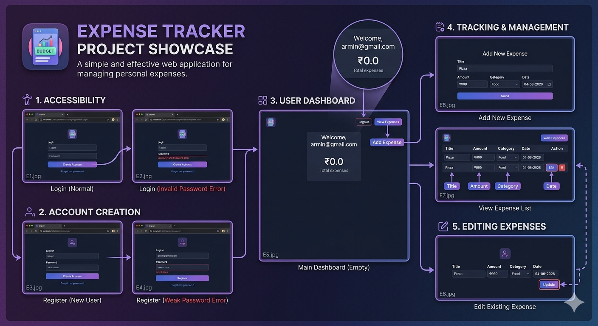

# 💰 Expense Tracker Web Application

A full-stack Expense Tracker Web Application developed using Java, Servlets, JSP, HTML, CSS, and MySQL. This application helps users manage their daily expenses by allowing them to register, log in, add expenses, view records, edit entries, and track spending efficiently through a user-friendly web interface.

## 📌 Features

* User Registration and Login
* Secure Session Management
* Add New Expenses
* View Expense Records
* Edit Existing Expenses
* Delete Expenses
* Dashboard for Expense Management
* MySQL Database Integration
* Responsive and User-Friendly Interface

## 🛠️ Technologies Used

* Java
* Java Servlets
* JSP (Java Server Pages)
* HTML5
* CSS3
* MySQL
* JDBC
* Apache Tomcat
* Eclipse IDE

## 📂 Project Structure

```text
src/
├── main/java/tracker/
│   ├── AddExpenseServlet01.java
│   ├── DashboardServlet01.java
│   ├── DBConnection.java
│   ├── DeleteExpenseServlet01.java
│   ├── EditExpenseServlet01.java
│   ├── LoginServlet01.java
│   ├── LogoutServlet01.java
│   ├── RegisterServlet01.java
│   ├── UpdateExpenseServlet01.java
│   └── ViewExpenseServlet01.java

src/main/webapp/
├── addExpense.html
├── dashboard.jsp
├── login.html
├── register.html
├── style.css
└── WEB-INF/
```

## 🚀 How to Run

1. Clone or download this repository.
2. Open the project in Eclipse IDE.
3. Configure Apache Tomcat Server.
4. Create a MySQL database.
5. Update database credentials in `DBConnection.java`.
6. Add MySQL Connector JAR if required.
7. Deploy the project on Tomcat.
8. Run the application through the server.

## 📸 Application Preview



## 🎯 Learning Outcomes

This project demonstrates:

* Java Web Development
* Servlet and JSP Development
* Database Connectivity using JDBC
* Session Management
* CRUD Operations
* MVC-Based Application Design
* Frontend and Backend Integration
* Problem Solving and Software Development Skills

## 👨‍💻 Author

**Armin Taranum**

Computer Science & Engineering Student

## ⭐ Project Purpose

This project was developed to strengthen full-stack Java web development skills and provide a practical solution for personal expense management.
